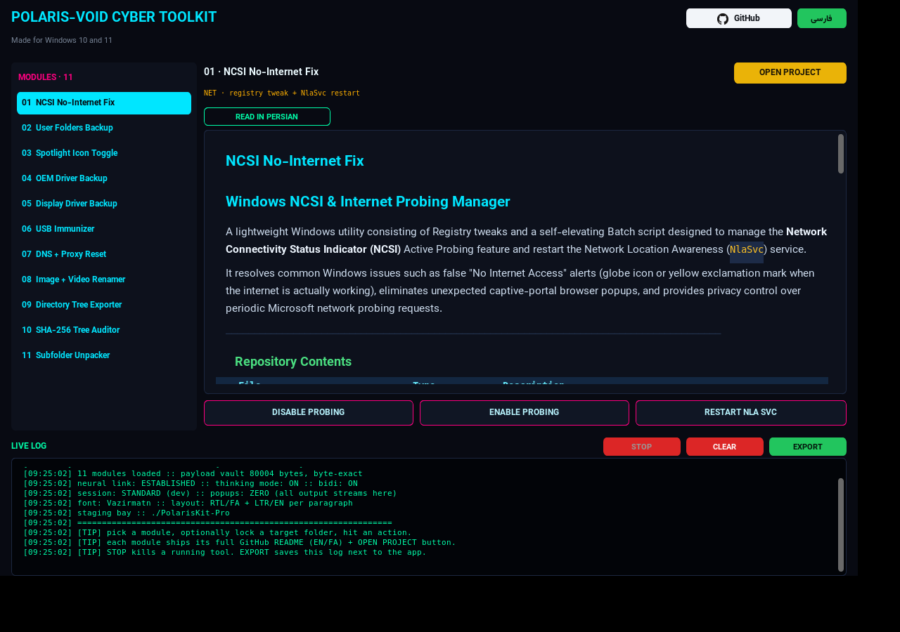
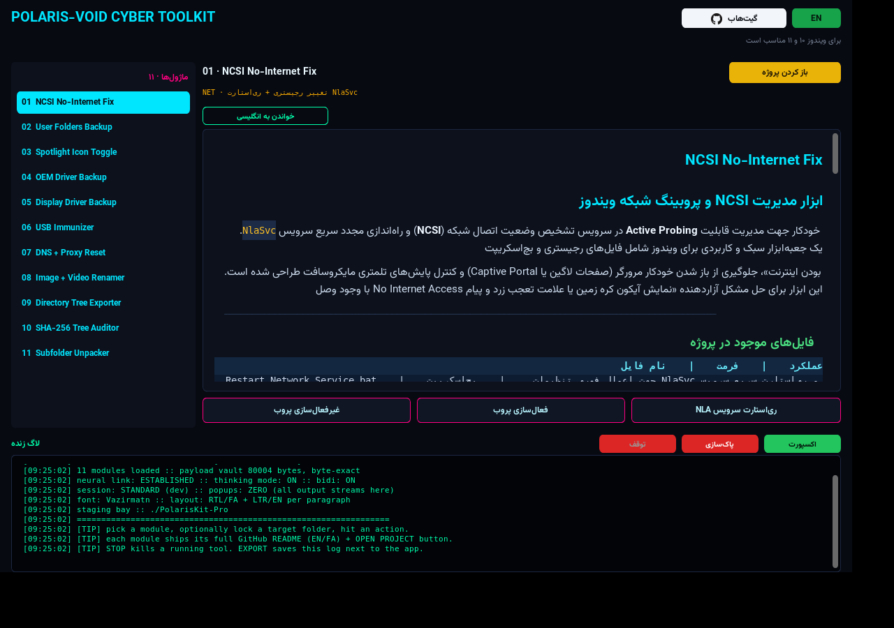

# ‏POLARIS-VOID CYBER TOOLKIT — نسخه Pro 🕶️

هاب نئونی یک‌جای هر **۱۱ ابزار ویندوزی** [Polaris-Void](https://github.com/Polaris-Void) —
**تک‌فایل، بدون نصب، با رابط سایبرپانکی و حالت تفکر.**




---

## ✨ ویژگی‌های نسخه Pro

| # | ویژگی | توضیح |
|---|---|---|
| ۱ | **اجرای ادمین از ابتدا** | موقع اجرا یک‌بار UAC می‌پرسد و کل نشست ادمین می‌شود؛ دیگر وسط کار پرامپت نمی‌بینی |
| ۲ | **صفر پنجره اضافه** | هر ابزار کاملاً مخفی اجرا می‌شود و خروجی‌اش **زنده داخل لاگ خود برنامه** استریم می‌شود (دکمه STOP هم دارد) |
| ۳ | **فونت وزیرمتن** | کل رابط با Vazirmatn (داخل فایل باندل شده، بدون نیاز به نصب فونت) |
| ۴ | **راست‌چین/چپ‌چین درست** | سوییچ زنده فارسی/انگلیسی؛ هر پاراگراف فارسی راست‌چین و انگلیسی چپ‌چین |
| ۵ | **صندوق داخل برنامه** | «VIEW VAULT» به‌جای باز کردن Explorer، محتویات بکاپ را در پنل داخلی نشان می‌دهد |
| ۶ | **لینک‌ها در مرورگر** | دکمه سفید GitHub (با لوگو) + دکمه `OPEN PROJECT` مخصوص هر ۱۱ پروژه، مستقیم در مرورگر باز می‌شوند |
| ۷ | **پیش‌نمایش ریدمی (رندر شده)** | متن کامل `README.md` و `README.FA.md` هر پروژه از گیت‌هاب، **رندر شده و زیبا** داخل برنامه (هدینگ رنگی، جدول، کد، بولت، لینک کلیک‌شونده) با نام پروژه بالای ریدمی؛ پیش‌فرض انگلیسی + دکمه جابه‌جایی زنده |
| ۸ | **اکسپورت لاگ** | دکمه سبز `EXPORT` کل لاگ را با مهر زمانی کنار فایل اجرایی ذخیره می‌کند |
| ۹ | **فارسی کامل** | در حالت فارسی همه‌چیز (دکمه‌ها، ریدمی، وضعیت) بجز نام پروژه‌ها و متن لاگ‌ها فارسی است |
| ۱۰ | **توقف تمیز** | دکمه `STOP` درخت کامل پردازش را می‌بندد و رابط را خودکار رفرش می‌کند (بدون فریز) |

> منطق هر ۱۱ ابزار **بایت‌به‌بایت همان اسکریپت‌های اصلی** است (۱۹ فایل `.bat`/`.reg`/`.ico` داخل برنامه جاسازی شده و موقع اجرا در `%TEMP%\PolarisKit-Pro` بازسازی می‌شوند).

## 🚀 ساخت فایل EXE (روی ویندوز، ۳ دقیقه)

1. پایتون ۳٫۱۰+ را از python.org نصب کن (تیک **Add to PATH** یادت نره).
2. پوشه `python` را به ویندوز منتقل کن و **`Build-EXE.bat`** را اجرا کن.
3. خروجی: `python\dist\PolarisKit-Pro.exe` — تک‌فایل قابل‌حمل.

اولین اجرا: ویندوز UAC ادمین می‌خواهد (طبیعی است — کل برنامه ادمین‌محور است). اگر SmartScreen آمد: `More info ← Run anyway`.

## 🗂️ هر ماژول چه می‌کند؟

| ماژول | کار | نیاز به پوشه؟ |
|---|---|---|
| NCSI No-Internet Fix | رفع آیکون «No Internet» کاذب + مدیریت پروبینگ | نه |
| User Folders Backup | بکاپ/بازیابی ۶ پوشه کاربر + بازرس صندوق داخلی | نه |
| Spotlight Icon Toggle | مخفی/نمایش آیکون «Learn about this picture» + ری‌استارت اکسپلورر | نه |
| OEM Driver Backup | بکاپ/بازیابی همه درایورها (DISM+PnPUtil) + بازرس صندوق | نه |
| Display Driver Backup | بکاپ/بازیابی تخصصی درایور گرافیک + بازرس صندوق | نه |
| USB Immunizer | ایمن‌سازی فلش + آیکون/لیبل اختصاصی | ✅ ریشه فلش |
| DNS + Proxy Reset | ریست DNS به DHCP + قطع پروکسی + Flush | نه |
| Image + Video Renamer | تغییرنام گروهی به `.jpg` / `.mp4` (بدون بازنویسی) | ✅ |
| Tree Exporter | گزارش درختی + حجم + تاریخ (UTF-8) | ✅ |
| SHA-256 Auditor | درخت + متادیتا + هش SHA-256 تک‌تک فایل‌ها | ✅ |
| Subfolder Unpacker | انتقال همه فایل‌ها از ساب‌فولدرها به پوشه اصلی | ✅ |

تحلیل فنی کامل هرکدام ← **`ANALYSIS_FA.md`**

## 🧠 «حالت تفکر» + استریم زنده

```
[THINK] neural link :: module NCSI-FIX authenticated
[THINK] scope :: LOCAL SYSTEM (no folder needed)
[THINK] privilege scan :: ELEVATED session, no more prompts
[THINK] payload :: polaris_tool.bat (183 bytes, byte-exact original)
[EXEC] dispatching :: NCSI-FIX / RESTART NLA SVC
[EXEC] PID 4820 :: streaming output (hidden, in-app)...
  | The Network Location Awareness service is stopping...
  | The Network Location Awareness service was started successfully.
[ OK ] process exited clean :: code 0
```

## ⚠️ سه احتیاط مهم

1. **Unpacker** هم‌نام‌ها را بی‌سروصدا بازنویسی می‌کند → قبلش کپی بگیر.
2. **DNS Reset** پروکسی/DNS دستی‌ات (شکن، سازمانی...) را پاک می‌کند → آگاهانه بزن.
3. **Driver Restore** را فقط روی همان سیستم انجام بده + قبلش Restore Point.

## 📁 ساختار پروژه

```
polaris-kit/
├── README_FA.md            ← همین فایل
├── ANALYSIS_FA.md          ← تحلیل عمیق ۱۱ پروژه
├── python/                 ← نسخه Pro (تنها نسخه ارائه‌شده)
│   ├── PolarisKit.py       ← سورس اصلی
│   ├── payloads.py         ← ۱۹ پیلود اصلی (base64)
│   ├── Build-EXE.bat       ← بیلد تک‌کلیکه (UAC ادمین + فونت)
│   ├── requirements.txt
│   ├── icon.ico            ← آیکون EXE و پنجره (یکسان)
│   ├── icon.png            ← آیکون تسک‌بار لینوکس/پیش‌نمایش
│   ├── gh.png              ← لوگوی دکمه سفید GitHub
│   └── fonts/              ← وزیرمتن Regular/Bold (OFL-1.1)
├── assets/raw/             ← ۱۹ فایل اصلی گیت‌هاب (باینری خام)
├── legacy-c/               ← سورس قدیمی C (آرشیو، پشتیبانی نمی‌شود)
└── preview_*.png           ← اسکرین‌شات‌های واقعی تست‌شده
```

## ✅ تست‌شده

- یکپارچگی بایت‌به‌بایت هر ۱۹ پیلود در برابر فایل‌های گیت‌هاب
- اجرای واقعی رابط (EN/FA)، انتخاب هر ۱۱ ماژول، بازرس صندوق، باز شدن لینک در مرورگر، ردیف پوشه
- ریدمی داخلی هر ماژول (EN پیش‌فرض + تاگل FA)، اکسپورت فایل لاگ، مسیر رفرش بعد از STOP — همه سبز
- موتور patch مسیر، دیکد خروجی UTF-8/ANSI، شمارش بایت‌ها — همه سبز

## 🆕 نسخه v1.2

- **فارسی تمیز روی ویندوز:** متن فارسی بدون تبدیل اضافه نمایش داده می‌شود (ویندوز خودش راست‌به‌چپ را مدیریت می‌کند)
- **لینک‌ها در مرورگر:** هر ۶ دکمه گیت‌هاب مستقیم در مرورگر باز می‌شوند
- **رابط مینیمال:** تایپوگرافی و فاصله‌گذاری تمیزتر، شمارنده `// MODULES · ۱۱`، هایلایت ثابت ماژول انتخاب‌شده

## 🆕 نسخه v1.3

- **ریدمی داخلی هر پروژه:** فارسی + انگلیسی داخل برنامه؛ پیش‌فرض انگلیسی با دکمه جابه‌جایی زنده (لینک متنی اضافه حذف شد)
- **دکمه مخصوص هر پروژه:** هر ۱۱ ماژول دکمه `OPEN PROJECT` خودش را دارد که صفحه گیت‌هاب همان پروژه را باز می‌کند
- **تمیزی تزئینات:** حذف `//` های اضافه، حذف خط توکن، زیرنویس جدید «برای ویندوز ۱۰ و ۱۱ مناسب است»
- **فارسی کامل:** در حالت فارسی همه‌چیز بجز نام پروژه‌ها و لاگ‌ها فارسی می‌شود (دکمه‌ها، ریدمی، نوار وضعیت با اعداد فارسی)
- **دکمه‌های کنسول:** به ترتیب `EXPORT` سبز، `CLEAR` قرمز، `STOP` — با فاصله درست از برچسب لاگ
- **توقف بدون فریز:** بستن درخت پردازش (`taskkill /T`) + رفرش خودکار رابط بعد از توقف
- **آیکون یکسان:** آیکون جدید نئونی — هم روی فایل EXE هم روی پنجره و تسک‌بار
- **دکمه سفید گیت‌هاب** با لوگوی رسمی + **دکمه سبز زبان**

## 🆕 نسخه v1.4

- **ریدمی کامل از گیت‌هاب:** متن کامل `README.md` و `README.FA.md` هر ۱۱ پروژه داخل برنامه + نام پروژه بالای ریدمی (با اسکرول)
- **ترتیب دکمه‌های کنسول:** از راست به چپ `EXPORT` سبز، `CLEAR` قرمز، `STOP` قرمز
- **دکمه طلایی پروژه:** `OPEN PROJECT` هم‌استایل دکمه اکسپورت ولی طلایی
- **حذف شمارنده عملیات** از خط اطلاعات ماژول + **حذف نوار وضعیت** پایین برنامه

## 🆕 نسخه v1.5

- **دکمه سفید GitHub:** متن و لوگو دقیقاً وسط دکمه (بافتون + لوگو، ترازو به‌پیکسل)
- **مرکز‌چینی همه دکمه‌ها:** متن (و لوگو) هر دکمه در کل رابط — از سایدبار تا کنسول — از هر چهار طرف وسط است (تعمیر مشکل «متن کمی بالا بودن» با جبران اندازه خط فونت وزیرمتن)
- **پیش‌نمایش ریدمی:** به‌جای کد خام مارک‌داون، ریدمی‌ها **رندر شده** نمایش داده می‌شوند: عنوان‌های رنگی (H1 فیروزه‌ای / H2 سبز / H3 آبی)، **بولد**، کد داخل خط با پس‌زمینه کهربایی، جدول‌های راه‌راه با هدر، لیست‌های نقطه‌دار/شماره‌دار فارسی، خط جداکننده و لینک‌های کلیک‌شونده — فارسی راست‌چین و انگلیسی چپ‌چین
- **عنوان پنجره:** نام پنجره برنامه موقع اجرا `PolarisKit-Pro` می‌شود (به‌جای عنوان قدیمی)

## 🙏 کردیت

- منطق ابزارها: **[Polaris-Void (Avatar)](https://github.com/Polaris-Void)** — ‏Apache-2.0
- فونت رابط: **[Vazirmatn](https://github.com/rastikerdar/vazirmatn)** — ‏SIL Open Font License 1.1
